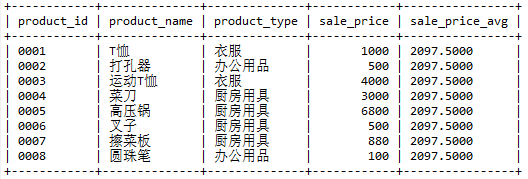

# 第三章 复杂一点的查询

-----

# 3.1 视图

``` sql
  SELECT product_name FROM view_product;
```

执行结果

``` 
--------------+
| product_name |
+--------------+
| T恤          |
| 打孔器       |
| 运动T恤      |
| 菜刀         |
| 高压锅       |
| 叉子         |
| 擦菜板       |
| 圆珠笔       |
+--------------+
8 rows in set (0.00 sec)

```

## 3.1.1 什么是视图

视图是一个虚拟的表，视图是依据SELECT语句来创建的。

操作视图是在根据创建视图的SELECT语句生成的虚拟表上做SQL操作。

## 3.1.2 视图与表有什么区别

视图不保存实际数据， 视图保存 SELECT 语句。

表保存实际数据。

使用视图时会执行视图保存的 SELECT 语句生成临时表。

## 3.1.3 为什么会存在视图

主要有以下几点原因：

1.  通过定义视图可以将频繁使用的SELECT语句保存以提高效率。
2.  通过定义视图可以使用户看到的数据更加清晰。
3.  通过定义视图可以不对外公开数据表全部字段，增强数据的保密性。
4.  通过定义视图可以降低数据的冗余。

## 3.1.4 如何创建视图

创建视图的基本语法如下：

``` sql
CREATE VIEW <视图名称>(<列名1>,<列名2>,...) AS <SELECT语句>
```

其中SELECT 语句需要书写在 AS 关键字之后。 SELECT 语句中列的排列顺序和视图中列的排列顺序相同， SELECT 语句中的第 1 列就是视图中的第 1 列， SELECT 语句中的第 2 列就是视图中的第 2 列，以此类推。而且视图的列名是在视图名称之后的列表中定义的。

注意： 视图名在数据库中需要是唯一的，不能与其他视图和表重名。

视图不仅可以基于真实表，可以在视图的基础上继续创建视图。

对多数 DBMS 来说， 多重视图会降低 SQL 的性能。

  - 注意事项

需要注意的是在一般的DBMS中定义视图时不能使用ORDER BY语句。下面这样定义视图是错误的。

``` sql
CREATE VIEW productsum (product_type, cnt_product)
    AS
SELECT product_type, COUNT(*)
  FROM product
 GROUP BY product_type
 ORDER BY product_type;
```

原因： 视图和表一样，**数据行都是没有顺序的**。

  - 基于单表的视图

我们在product表的基础上创建一个视图，如下：

``` sql
CREATE VIEW productsum (product_type, cnt_product)
AS
SELECT product_type, COUNT(*)
  FROM product
 GROUP BY product_type ;
```

执行结果:

``` 
Query OK, 0 rows affected (0.02 sec)

```

创建的视图如下图所示：

``` 
mysql> select *
    -> from productsum;
+--------------+-------------+
| product_type | cnt_product |
+--------------+-------------+
| 衣服         |           2 |
| 办公用品     |           2 |
| 厨房用具     |           4 |
+--------------+-------------+
3 rows in set (0.00 sec)

```

  - 基于多表的视图

创建表 `shop_product`，相关代码如下：

``` sql
CREATE TABLE shop_product
(shop_id    CHAR(4)       NOT NULL,
 shop_name  VARCHAR(200)  NOT NULL,
 product_id CHAR(4)       NOT NULL,
 quantity   INTEGER       NOT NULL,
 PRIMARY KEY (shop_id, product_id));

INSERT INTO shop_product (shop_id, shop_name, product_id, quantity) VALUES ('000A',	'东京',		'0001',	30);
INSERT INTO shop_product (shop_id, shop_name, product_id, quantity) VALUES ('000A',	'东京',		'0002',	50);
INSERT INTO shop_product (shop_id, shop_name, product_id, quantity) VALUES ('000A',	'东京',		'0003',	15);
INSERT INTO shop_product (shop_id, shop_name, product_id, quantity) VALUES ('000B',	'名古屋',	'0002',	30);
INSERT INTO shop_product (shop_id, shop_name, product_id, quantity) VALUES ('000B',	'名古屋',	'0003',	120);
INSERT INTO shop_product (shop_id, shop_name, product_id, quantity) VALUES ('000B',	'名古屋',	'0004',	20);
INSERT INTO shop_product (shop_id, shop_name, product_id, quantity) VALUES ('000B',	'名古屋',	'0006',	10);
INSERT INTO shop_product (shop_id, shop_name, product_id, quantity) VALUES ('000B',	'名古屋',	'0007',	40);
INSERT INTO shop_product (shop_id, shop_name, product_id, quantity) VALUES ('000C',	'大阪',		'0003',	20);
INSERT INTO shop_product (shop_id, shop_name, product_id, quantity) VALUES ('000C',	'大阪',		'0004',	50);
INSERT INTO shop_product (shop_id, shop_name, product_id, quantity) VALUES ('000C',	'大阪',		'0006',	90);
INSERT INTO shop_product (shop_id, shop_name, product_id, quantity) VALUES ('000C',	'大阪',		'0007',	70);
INSERT INTO shop_product (shop_id, shop_name, product_id, quantity) VALUES ('000D',	'福冈',		'0001',	100);
```

在product表和shop\_product表的基础上创建视图。

``` sql
CREATE VIEW view_shop_product(product_type, sale_price, shop_name)
AS
SELECT product_type, sale_price, shop_name
  FROM product,
       shop_product
 WHERE product.product_id = shop_product.product_id;
```

执行结果

``` 
Query OK, 0 rows affected (0.01 sec)

```

创建的视图如下所示

``` 
mysql> select *
    -> from view_shop_product;
+--------------+------------+-----------+
| product_type | sale_price | shop_name |
+--------------+------------+-----------+
| 衣服         |       1000 | 东京      |
| 办公用品     |        500 | 东京      |
| 衣服         |       4000 | 东京      |
| 办公用品     |        500 | 名古屋    |
| 衣服         |       4000 | 名古屋    |
| 厨房用具     |      30000 | 名古屋    |
| 厨房用具     |       5000 | 名古屋    |
| 厨房用具     |       8800 | 名古屋    |
| 衣服         |       4000 | 大阪      |
| 厨房用具     |      30000 | 大阪      |
| 厨房用具     |       5000 | 大阪      |
| 厨房用具     |       8800 | 大阪      |
| 衣服         |       1000 | 福冈      |
+--------------+------------+-----------+
13 rows in set (0.00 sec)

```

在这个视图的基础上进行查询

``` sql
SELECT sale_price, shop_name
  FROM view_shop_product
 WHERE product_type = '衣服';
```

查询结果为：

``` 
+------------+-----------+
| sale_price | shop_name |
+------------+-----------+
|       1000 | 东京      |
|       4000 | 东京      |
|       4000 | 名古屋    |
|       4000 | 大阪      |
|       1000 | 福冈      |
+------------+-----------+
5 rows in set (0.00 sec)

```

## 3.1.5 如何修改视图结构

修改视图结构的基本语法如下：

``` sql
ALTER VIEW <视图名> AS <SELECT语句>
```

其中视图名在数据库中需要是唯一的，不能与其他视图和表重名。

也可以通过将当前视图删除然后重新创建的方式达到修改的效果。

  - 修改视图

我们修改上方的productsum视图为

``` sql
ALTER VIEW productsum
    AS
        SELECT product_type, sale_price
          FROM product
         WHERE regist_date > '2009-09-11';
```

此时productsum视图内容如下所示

``` 
Query OK, 0 rows affected (0.02 sec)

mysql> SELECT * FROM productsum;
+--------------+------------+
| product_type | sale_price |
+--------------+------------+
| 衣服         |       1000 |
| 办公用品     |        500 |
| 衣服         |       4000 |
| 厨房用具     |      30000 |
| 厨房用具     |      68000 |
| 厨房用具     |       5000 |
| 厨房用具     |       8800 |
+--------------+------------+
7 rows in set (0.00 sec)

```

## 3.1.6 如何更新视图内容

视图是基于表的， 更新视图需要底层表可以更新。

对于视图来说，包含以下结构的任意一种都是不可以被更新的：

  - 聚合函数 SUM()、MIN()、MAX()、COUNT() 等。

  - DISTINCT 关键字。

  - GROUP BY 子句。

  - HAVING 子句。

  - UNION 或 UNION ALL 运算符。

  - FROM 子句中包含多个表。

  - 更新视图

``` sql
UPDATE productsum
   SET sale_price = '5000'
 WHERE product_type = '办公用品';
```

执行结果

``` 
Query OK, 1 row affected (0.01 sec)
Rows matched: 1  Changed: 1  Warnings: 0

```

查看 productsum 视图

``` 
mysql> SELECT * FROM productsum;
+--------------+------------+
| product_type | sale_price |
+--------------+------------+
| 衣服         |       1000 |
| 办公用品     |       5000 |
| 衣服         |       4000 |
| 厨房用具     |      30000 |
| 厨房用具     |      68000 |
| 厨房用具     |       5000 |
| 厨房用具     |       8800 |
+--------------+------------+
7 rows in set (0.00 sec)

```

查看原表

``` 
mysql> SELECT *
    -> FROM product;
+------------+--------------+--------------+------------+----------------+-------------+
| product_id | product_name | product_type | sale_price | purchase_price | regist_date |
+------------+--------------+--------------+------------+----------------+-------------+
| 0001       | T恤          | 衣服         |       1000 |            500 | 2009-10-10  |
| 0002       | 打孔器       | 办公用品     |       5000 |            320 | 2009-10-10  |
| 0003       | 运动T恤      | 衣服         |       4000 |           2800 | 2009-10-10  |
| 0004       | 菜刀         | 厨房用具     |      30000 |           2800 | 2009-10-10  |
| 0005       | 高压锅       | 厨房用具     |      68000 |           5000 | 2009-10-10  |
| 0006       | 叉子         | 厨房用具     |       5000 |           NULL | 2009-10-10  |
| 0007       | 擦菜板       | 厨房用具     |       8800 |            790 | 2009-10-10  |
| 0008       | 圆珠笔       | 办公用品     |        100 |           NULL | NULL        |
+------------+--------------+--------------+------------+----------------+-------------+
8 rows in set (0.00 sec)

```

视图只可修改能看到的内容， 故原表只有一条被修改。

**注意：不推荐通过视图来修改表**

## 3.1.7 如何删除视图

删除视图的基本语法如下：

``` sql
DROP VIEW <视图名1> [ , <视图名2> …]
```

注意：需要有相应的权限才能成功删除。

  - 删除视图

删除productsum视图

``` sql
DROP VIEW productsum;
```

执行结果

``` 
Query OK, 0 rows affected (0.02 sec)

```

# 3.2 子查询

## 3.2.1 什么是子查询

子查询指一个查询语句嵌套在另一个查询语句内部的查询。

在 SELECT 子句中先计算子查询，子查询结果作为外层另一个查询的过滤条件，查询可以基于一个表或者多个表。

## 3.2.2 子查询和视图的关系

子查询就是将用来定义视图的 SELECT 语句直接用于 FROM 子句当中。

其中AS \*\*\* 可以看作是子查询的名称。

子查询是一次性的，生存期只到在 SELECT 语句执行之后。

## **3.2.3 嵌套子查询**

子查询可以嵌套， 没有限制。

**嵌套子查询会降低可读性和执行效率， 要尽可能避免**

## 3.2.4 标量子查询

标量子查询返回表中具体的**某一行的某一列**的数据。

## 3.2.5 标量子查询有什么用

通过查询、运算返回一定条件的标量。

## 3.2.6 关联子查询

  - 什么是关联子查询

关联子查询通过关联语句， 将返回多行的的子查询语句， 与外围关联起来， 返回某一行， 可以起到多次标量子查询的作用。

  - 关联子查询与子查询的联系

关联子查询亦是子查询。

# 小结

视图和子查询可以数据进行多次筛选， 来得到所需数据。

要避免多次嵌套， 严重降低可读性与执行效率。

# 练习题-第一部分（请给出代码、包含代码及代码执行结果的截图）

## 3.1

创建出满足下述三个条件的视图（视图名称为 ViewPractice5\_1）。使用 product（商品）表作为参照表，假设表中包含初始状态的 8 行数据。

  - 条件 1：销售单价大于等于 1000 日元。
  - 条件 2：登记日期是 2009 年 9 月 20 日。
  - 条件 3：包含商品名称、销售单价和登记日期三列。

``` sql
CREATE VIEW ViewPractice5_1 (product_name, sale_price, regist_date) AS
SELECT product_name, sale_price, regist_date
  FROM product
 WHERE sale_price >= 1000 AND regist_date = '2009-09-20';
```

对该视图执行 SELECT 语句的结果如下所示。

``` sql
SELECT * FROM ViewPractice5_1;
```

执行结果

``` sql
product_name | sale_price | regist_date
--------------+------------+------------
T恤衫         | 　 1000    | 2009-09-20
菜刀          |    3000    | 2009-09-20
```

附图


## 3.2

向习题一中创建的视图 `ViewPractice5_1` 中插入如下数据，会得到什么样的结果？为什么？

``` sql
INSERT INTO ViewPractice5_1 VALUES (' 刀子 ', 300, '2009-11-02');
```

答：

会得到错误。

向视图 ViewPractice5\_1 中插入数据相当于向表 product 中插入，

表中 product\_type 是 NOT NULL 的， 默认值为 NULL ， 所以出入会出错。

## 3.3

请根据如下结果编写 SELECT 语句，其中 sale\_price\_avg 列为全部商品的平均销售单价。



``` sql
SELECT product_id, product_name, product_type, sale_price, (SELECT AVG(sale_price) FROM product) AS sale_price_avg
  FROM product;
```

附图


## 3.4

请根据习题一中的条件编写一条 SQL 语句，创建一幅包含如下数据的视图（名称为AvgPriceByType）。


提示：其中的关键是 `sale_price_avg_type` 列。与习题三不同，这里需要计算出的 是各商品种类的平均销售单价。这与使用关联子查询所得到的结果相同。 也就是说，该列可以使用关联子查询进行创建。问题就是应该在什么地方使用这个关联子查询。

``` sql
SELECT product_id, product_name, product_type, sale_price,
       (SELECT AVG(sale_price)
          FROM product AS p2
         WHERE p1.product_type = p2.product_type
         GROUP BY product_type) AS sale_price_avg_type
  FROM product AS p1;
```

附图


# 3.3 各种各样的函数

函数，给一个输入值，它便按照预设的程序定义给出返回值，输入值称为`参数`。

函数大致分为如下几类：

  - 算术函数    （用来进行数值计算的函数）
  - 字符串函数 （用来进行字符串操作的函数）
  - 日期函数     （用来进行日期操作的函数）
  - 转换函数     （用来转换数据类型和值的函数）
  - 聚合函数     （用来进行数据聚合的函数）

## 3.3.1 算数函数

  - `+ - * /`四则运算.

  - ABS -- 绝对值

语法：`ABS( 数值 )`

ABS 函数用于计算一个数字的绝对值，表示一个数到原点的距离。

当 ABS 函数的参数为`NULL`时，返回值也是`NULL`。

  - MOD -- 求余数 ：`MOD( 被除数，除数 )`

注意：主流的 DBMS 都支持 MOD 函数，只有SQL Server 不支持该函数，其使用`%`符号来计算余数。

  - ROUND -- 四舍五入 ：`ROUND( 对象数值，保留小数的位数 )`

注意：当参数 **保留小数的位数** 为变量时，可能会遇到错误，请谨慎使用变量。

## 3.3.2 字符串函数

  - CONCAT -- 拼接 ：`CONCAT(str1, str2, str3)`

  - LENGTH -- 字符串长度 ：`LENGTH( 字符串 )`

  - LOWER -- 小写转换

  - UPPER -- 大写转换

  - REPLACE -- 字符串的替换 ：`REPLACE( 对象字符串，替换前的字符串，替换后的字符串 )`

  - SUBSTRING -- 字符串的截取 ：`SUBSTRING （对象字符串 FROM 截取的起始位置 FOR 截取的字符数）`

  - SUBSTRING\_INDEX -- 字符串按索引截取 ：`SUBSTRING_INDEX (原始字符串， 分隔符，n)`

  - REPEAT -- 字符串按需重复多次 ：`REPEAT(string, number)`

## 3.3.3 日期函数

  - CURRENT\_DATE -- 获取当前日期

  - CURRENT\_TIME -- 当前时间

  - CURRENT\_TIMESTAMP -- 当前日期和时间

  - EXTRACT -- 截取日期元素 ：`EXTRACT(日期元素 FROM 日期)`

## 3.3.4 转换函数

  - CAST -- 类型转换 ：`CAST（转换前的值 AS 想要转换的数据类型）`

  - COALESCE -- 将NULL转换为其他值 ：`COALESCE(数据1，数据2，数据3……)`

# 3.4 谓词

## 3.4.1 什么是谓词

谓词就是返回值为真值的函数。包括`TRUE / FALSE / UNKNOWN`。

谓词主要有以下几个：

  - LIKE
  - BETWEEN
  - IS NULL、IS NOT NULL
  - IN
  - EXISTS

## 3.4.2 LIKE谓词 -- 用于字符串的部分一致查询

当需要进行字符串的部分一致查询时需要使用该谓词。

  - 前方一致：`LIKE '***%'`

  - 中间一致：`LIKE '%ddd%'`

  - 后方一致：`LIKE '%ddd'`

  - `_`下划线匹配任意 1 个字符: `LIKE '***__'`

## 3.4.3 BETWEEN谓词 -- 用于范围查询

使用 BETWEEN 可以进行范围查询。该谓词使用了 3 个参数。

`BETWEEN ** AND **`

BETWEEN 是闭区间,结果中包含临界值。

## 3.4.4 IS NULL、 IS NOT NULL -- 用于判断是否为NULL

选取出值为 NULL 的列的数据，不能使用 =，只能使用特定的谓词 `IS NULL` 。

与此相反，想要选取 NULL 以外的数据时，需要使用 `IS NOT NULL` 。

## 3.4.5 IN谓词 -- OR的简便用法

多个查询条件取并集时可以选择使用`or`语句。

`IN(值1, 值2, 值3, ......)`
可以代替上述 SQL 语句增加可读性。

包含否定形式 `NOT IN` 。

注意： IN 和 NOT IN 无法选取出NULL数据。

## 3.4.6 使用子查询作为IN谓词的参数

  - IN和子查询

IN 谓词（NOT IN 谓词）具有其他谓词所没有的用法，那就是可以使用子查询作为其参数。

  - NOT IN和子查询

NOT IN 同样支持子查询作为参数，用法和 in 完全一样。

## 3.4.7 EXIST 谓词

  - EXIST谓词的使用方法

谓词的作用就是 **“判断是否存在满足某种条件的记录”**。

如果存在这样的记录就返回真（TRUE），如果不存在就返回假（FALSE）。

EXIST（存在）谓词的主语是“记录”。

  - EXIST的参数

EXIST 的左侧并没有任何参数。

EXIST 只需要在右侧书写 1 个参数，该参数通常都会是一个子查询。

EXIST 通常会使用关联子查询作为参数。

  - 子查询中的SELECT \*

由于 EXIST 只关心记录是否存在，因此返回哪些列都没有关系。

可以把在 EXIST 的子查询中书写 SELECT \* 当作 SQL 的一种习惯。

  - 使用NOT EXIST替换NOT IN

NOT EXIST 与 EXIST 相反，当“不存在”满足子查询中指定条件的记录时返回真（TRUE）。

# 3.5 CASE 表达式

## 3.5.1 什么是 CASE 表达式？

CASE 表达式是函数的一种。

CASE 表达式是在区分情况时使用的，这种情况的区分在编程中通常称为（条件）分支。

CASE表达式的语法分为简单CASE表达式和搜索CASE表达式两种。

搜索CASE表达式包含简单CASE表达式的全部功能。

语法：

``` sql
CASE WHEN <求值表达式> THEN <表达式>
     WHEN <求值表达式> THEN <表达式>
     WHEN <求值表达式> THEN <表达式>
     .
     .
     .
ELSE <表达式>
END  
```

上述语句执行时，依次判断 when 表达式是否为真值，是则执行 THEN 后的语句，如果所有的 when 表达式均为假，则执行 ELSE 后的语句。
无论多么庞大的 CASE 表达式，最后也只会返回一个值。

# 练习题-第二部分（请给出代码、包含代码及代码执行结果的截图）

## 3.5 判断题

四则运算中含有 NULL 时（不进行特殊处理的情况下），运算结果是否必然会变为NULL ？

答： 是。

## 3.6

对本章中使用的 `product`（商品）表执行如下 2 条 `SELECT` 语句，能够得到什么样的结果呢？

①

``` sql
SELECT product_name, purchase_price
  FROM product
 WHERE purchase_price NOT IN (500, 2800, 5000);
```

得到含有 `product_name` 和 `purchase_price` 两列，
`purchase_price` 值不等于 500, 2800, 5000 的记录。

②

``` sql
SELECT product_name, purchase_price
  FROM product
 WHERE purchase_price NOT IN (500, 2800, 5000, NULL);
```

得到含有 `product_name` 和 `purchase_price` 两列，
`purchase_price` 值不为 NULL 且不等于 500, 2800, 5000 的记录。

## 3.7

按照销售单价( `sale_price` )对练习 3.6 中的 `product`（商品）表中的商品进行如下分类。

  - 低档商品：销售单价在1000日元以下（T恤衫、办公用品、叉子、擦菜板、 圆珠笔）
  - 中档商品：销售单价在1001日元以上3000日元以下（菜刀）
  - 高档商品：销售单价在3001日元以上（运动T恤、高压锅）

请编写出统计上述商品种类中所包含的商品数量的 SELECT 语句，结果如下所示。

执行结果

``` sql
low_price | mid_price | high_price
----------+-----------+------------
        5 |         1 |         2
```

``` sql
SELECT (SELECT COUNT(*)
          FROM product
          WHERE sale_price <= 1000) AS low_price,
       (SELECT COUNT(*)
          FROM product
         WHERE sale_price >= 1001 AND sale_price <= 3000)  AS mid_price,
       (SELECT COUNT(*)
          FROM product
         WHERE sale_price >= 3001) AS high_price;
```

附图

